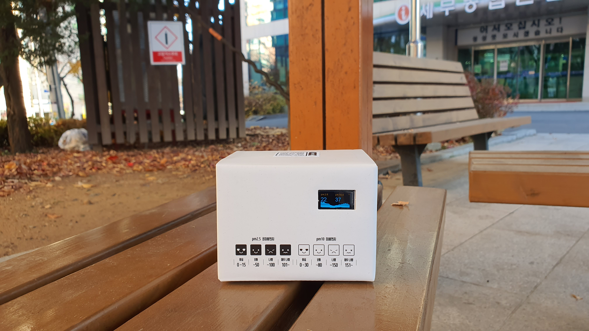

# FinedustMonitorWithGPS
Finedust (air pollution) monitoring station. Air pollution monitoring channel updates once per every minutes with PM10.0, PM2.5 readings from the Nova PM (SDS011) Sensor. Also includes real time location tracking capabilities with using the GY-NEO6MV2 GPS Sensor.
 
>**[Please note]**  
This project requires a GY-NEO6MV2 GPS Sensor. For a project that does not require a GPS module, Please visit the following link : https://github.com/happybono/FinedustMonitor
 

## What's New
### 
### December 16, 2019
[Read GPS data from ThingSpeak and displays it on the Google Maps using ESP12e NodeMCU and GPSNeo6MV2 Module.](https://github.com/happybono/FinedustMonitorWithGPS/blob/master/Maps/GoogleMaps.html "FinedustMonitorWithGPS/Maps/GoogleMaps.html")

### December 25, 2019
[Now supports [Channel Status Updates] in ThingSpeak](https://thingspeak.com/channels/920137) : Updated [FinedustMonitorWithGPS.ino](https://github.com/happybono/FinedustMonitorWithGPS/commit/01367946fd2dc10b39b39dec19309892311e92ea "/FinedustMonitorWithGPS/FinedustMonitorWithGPS.ino"), [server.ino](https://github.com/happybono/FinedustMonitorWithGPS/commit/3c3a89e9d8a4e45f591379dc96e2e7b67e15914d "/FinedustMonitorWithGPS/server.ino")

### December 29, 2019
[Various bugs fixed.](https://github.com/happybono/FinedustMonitorWithGPS/commit/d6d25d7cf4dc4b91f174259ea1e473220ab79385)

### January 20, 2020
["Latest PM sensor readings" plugin added in ThingSpeak.](https://github.com/happybono/FinedustMonitorWithGPS/tree/master/Plugins)

### January 21, 2020
[Displays additional information](https://github.com/happybono/FinedustMonitorWithGPS/blob/2882255266a72da46fa2a047b24e56b23cf94838/Plugins/StatusUpdates/CSS.css#L10) ([temperature](https://github.com/happybono/FinedustMonitorWithGPS/blob/2882255266a72da46fa2a047b24e56b23cf94838/Plugins/StatusUpdates/JavaScript.html#L34), [latitude](https://github.com/happybono/FinedustMonitorWithGPS/blob/2882255266a72da46fa2a047b24e56b23cf94838/Plugins/StatusUpdates/JavaScript.html#L35), [longitude](https://github.com/happybono/FinedustMonitorWithGPS/blob/2882255266a72da46fa2a047b24e56b23cf94838/Plugins/StatusUpdates/JavaScript.html#L36)) in the[ "Latest PM sensor readings" plugin.](https://github.com/happybono/FinedustMonitorWithGPS/tree/master/Plugins/StatusUpdates) 
Various bugs fixed.

### January 24, 2020
[Added "Reverse Geocoding" function in Google Maps.](https://github.com/happybono/FinedustMonitorWithGPS/blob/95abbb8ae55be63581fe9892d7d798f0c71eb8e6/Maps/GoogleMaps.html#L26) 
[Optimized loading time for Google Maps.](https://github.com/happybono/FinedustMonitorWithGPS/blob/95abbb8ae55be63581fe9892d7d798f0c71eb8e6/Maps/GoogleMaps.html)

#### What is Reverse Geocoding?
[Reverse geocoding](https://developers-dot-devsite-v2-prod.appspot.com/maps/documentation/javascript/examples/geocoding-reverse?fbclid=IwAR0UUWZSBd26wr4xeQWFMVwoLhHZiNoVgWJiLioRvJXlZkPapykpM2uBf6U) is the process of back (reverse) coding of a point location (latitude, longitude) to a readable address or place name. This permits the identification of nearby street addresses, places, and/or areal subdivisions such as neighbourhoods, county, state, or country. Combined with geocoding and routing services, reverse geocoding is a critical component of mobile location-based services and Enhanced 911 to convert a coordinate obtained by GPS to a readable street address which is easier to understand by the end user. 

### Jaunary 25, 2020
[Added an onclick event to displayed marker in Google Maps.](https://github.com/happybono/FinedustMonitorWithGPS/blob/95abbb8ae55be63581fe9892d7d798f0c71eb8e6/Maps/GoogleMaps.html#L80)

### February 05, 2020
[Added VBA (Visual Basic for Applications) code for reverse geocoding support in Microsoft Excel.](https://github.com/happybono/FinedustMonitorWithGPS/tree/master/Maps/Excel)
[Added Javascript code for reverse geocoding support in Google Sheets.](https://github.com/happybono/FinedustMonitorWithGPS/blob/master/Maps/Excel/GoogleSheets.js) (ⓒ Christos Samaras 2018)

## Specifications
### Scenarios
* Measuring the finedust contamination level in the air in a real time and display on the OLED Screen. 
* Measuring the current temperature.
* Track & update devices' location in a realtime.
* Read GPS data (longitude, latitude) from [ThingSpeak](https://thingspeak.com/channels/920137) and displays it on the [Google Maps](https://www.google.com/maps/) using the [Javascript API](https://developers.google.com/maps/documentation/javascript/tutorial).
* Refining data and synchronize with the web-based cloud service. (e.g. [ThingSpeak](https://www.thingspeak.com/), [Plaive](https://plaive.10make.com/)) 

### Connections
* 1 x Micro-USB

### Wireless
* IEEE 802.11 b/g/n Wi-Fi technology.

### Battery life 
* Up to 16 hours of typical device usage.

## Apparatus (Equipments)
### Platform
* ESP8266 NodeMCU

### SDS011 Dust Sensor
* Soldering required.
* D1 : TX of SDS011

### 0.96" I2C OLED Display 
* Soldering required.
* D3 : Data, D2 : Clock

### GY-NEO6MV2 GPS Sensor
* Soldering required.
* D6 & D7 : TX & RX of GY-NEO6MV2 respectively.

### DS18820 Temperature Sensor (Thermometer)
* Soldering required.
* D4 : Data

### KOKIRI A-PACK FIXIE 5 (KP-LS50) Portable Battery
* USB Port : Power
* Micro-USB : Charging Port
* Dimension : W (62.3 mm) × D (112.0 mm) × H (13.0 mm)
* Input : DC-5V / 2A
* Output : DC-5V / 2.1A
* Capacity : 5000 mAh

## Data Refinement / Synchronization
### ThingSpeak
* ThingSpeak (https://thingspeak.com/channels/920137)

  
### Plaive
* Plaive (https://plaive.10make.com/)

## Drivers
Please install https://github.com/squix78/esp8266-oled-ssd1306

## References / Bibliography
* Christos Samaras 2018, Geocoding & Reverse Geocoding Functions In Google Sheets, My Engineering World, Christos Samaras, viewed 5 February 2020, <https://myengineeringworld.net/2018/08/geocoding-reverse-gas.html>.

* ThingPulse 2020, ThingPulse/esp8266-oled-ssd1306, GitHub, viewed 24 November 2019, <https://github.com/ThingPulse/esp8266-oled-ssd1306>.
