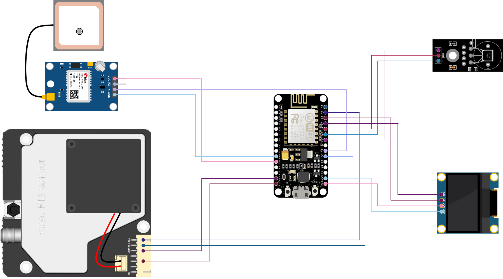
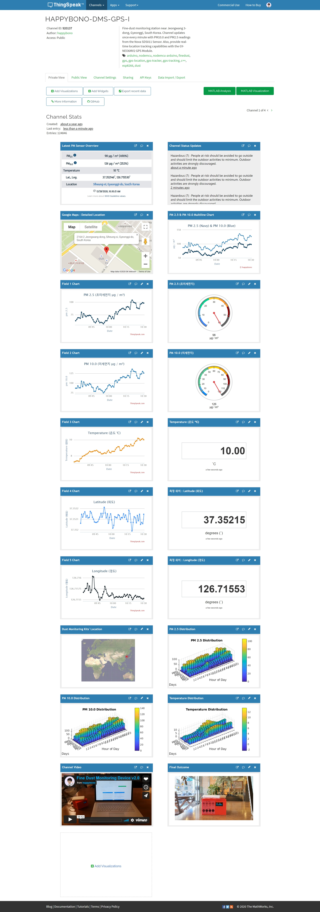

# FinedustMonitorWithGPS
Fine dust (air pollution) monitoring station. Air pollution monitoring channel updates once every minute with PM 10.0 and PM 2.5 readings from the Nova PM (SDS011) Sensor. Also includes real time location tracking capabilities using the GY-NEO6MV2 GPS Sensor.

 

                                                                                                         
 
### Please note
> This project requires a GY-NEO6MV2 GPS Sensor. For a project that does not require a GPS module, Please visit the following link: https://github.com/happybono/FinedustMonitor
 

## What's New

Click to Expand

  
### v1.0
#### November 24, 2019
> [Initial Release.](https://github.com/happybono/FinedustMonitorWithGPS/commit/aa9cbf7b85308d91ce775d71c36cdd96b5740529)

#### December 16, 2019
> [Read GPS data from ThingSpeak and displays it on Google Maps using ESP12e NodeMCU and GPSNeo6MV2 Module.](https://github.com/happybono/FinedustMonitorWithGPS/blob/master/Maps/GoogleMaps.html "FinedustMonitorWithGPS/Maps/GoogleMaps.html")

#### December 25, 2019
> [Now supports [Channel Status Updates] in ThingSpeak](https://thingspeak.com/channels/920137) : Updated [FinedustMonitorWithGPS.ino](https://github.com/happybono/FinedustMonitorWithGPS/commit/01367946fd2dc10b39b39dec19309892311e92ea "/FinedustMonitorWithGPS/FinedustMonitorWithGPS.ino"), [server.ino](https://github.com/happybono/FinedustMonitorWithGPS/commit/3c3a89e9d8a4e45f591379dc96e2e7b67e15914d "/FinedustMonitorWithGPS/server.ino")

#### December 29, 2019
> [Various bugs fixed.](https://github.com/happybono/FinedustMonitorWithGPS/commit/d6d25d7cf4dc4b91f174259ea1e473220ab79385)

#### January 20, 2020
> ["Latest PM sensor readings" plugin added in ThingSpeak.](https://github.com/happybono/FinedustMonitorWithGPS/tree/master/Plugins/StatusUpdates)

### v2.0
#### January 21, 2020
> [Displays additional information](https://github.com/happybono/FinedustMonitorWithGPS/blob/2882255266a72da46fa2a047b24e56b23cf94838/Plugins/StatusUpdates/CSS.css#L10) ([temperature](https://github.com/happybono/FinedustMonitorWithGPS/blob/2882255266a72da46fa2a047b24e56b23cf94838/Plugins/StatusUpdates/JavaScript.html#L34), [latitude](https://github.com/happybono/FinedustMonitorWithGPS/blob/2882255266a72da46fa2a047b24e56b23cf94838/Plugins/StatusUpdates/JavaScript.html#L35), [longitude](https://github.com/happybono/FinedustMonitorWithGPS/blob/2882255266a72da46fa2a047b24e56b23cf94838/Plugins/StatusUpdates/JavaScript.html#L36)) in the[ "Latest PM sensor readings" plugin.](https://github.com/happybono/FinedustMonitorWithGPS/tree/master/Plugins/StatusUpdates)  
>Various bugs fixed.

#### January 24, 2020
> [Added Reverse Geocoding function in Google Maps.](https://github.com/happybono/FinedustMonitorWithGPS/blob/95abbb8ae55be63581fe9892d7d798f0c71eb8e6/Maps/GoogleMaps.html#L26)  
> [Optimized loading time for Google Maps.](https://github.com/happybono/FinedustMonitorWithGPS/blob/95abbb8ae55be63581fe9892d7d798f0c71eb8e6/Maps/GoogleMaps.html)

#### Jaunary 25, 2020
> [Added an onclick event to displayed marker in Google Maps.](https://github.com/happybono/FinedustMonitorWithGPS/blob/95abbb8ae55be63581fe9892d7d798f0c71eb8e6/Maps/GoogleMaps.html#L80)

#### February 05, 2020
> [Added VBA (Visual Basic for Applications) code for reverse geocoding support in Microsoft Excel.](https://github.com/happybono/FinedustMonitorWithGPS/blob/master/Maps/Excel/GEOSage.vb) 
>   
> [Added Javascript (.gs) code for reverse geocoding support in Google Sheets.](https://github.com/happybono/FinedustMonitorWithGPS/blob/master/Maps/Excel/GoogleSheets.gs) ([ⓒ 2018 Christos Samaras](https://myengineeringworld.net/2018/08/geocoding-reverse-gas.html)) 
> [Added Javascript (.gs) code for reverse geocoding macro support in Google Sheets.](https://github.com/happybono/FinedustMonitorWithGPS/blob/master/Maps/Excel/GoogleSheetsGeocodingMacro.gs) ([ⓒ 2016 - 2017 Max Vilimpoc](https://github.com/nuket/google-sheets-geocoding-macro)) 
> 

#### February 19, 2020
> [Optimized performance for data processing.](https://thingspeak.com/channels/920137/api_keys)

#### February 20, 2020
> ["Email Alert" function added as a ThingSpeak Analysis plug-in.](https://github.com/happybono/FinedustMonitorWithGPS/blob/master/Plugins/Email/EmailNotifier.m) 

#### February 26, 2020
> [Performance improvements (up to 2× as faster than before) in the ADDRGEOCODE function in GEOSage.vb.](https://github.com/happybono/FinedustMonitorWithGPS/blob/master/Maps/Excel/GEOSage.vb#L86)   
> [Now supports Unicode using the Microsoft ActiveX Data Objects Library in the ADDRGEOCODE function in GEOSage.vb.](https://github.com/happybono/FinedustMonitorWithGPS/blob/master/Maps/Excel/GEOSage.vb#L115)

#### February 27, 2020
> [Added GEOSage sample files.](https://github.com/happybono/FinedustMonitorWithGPS/tree/master/Maps/Excel)  
> GEOSage sample includes Excel files that use demonstation data using Google Maps Geocoding API Key. The 
API key used in this project for geocoding and reverse geocoding feature is not provided for your use. 
The mock data demonstrates all functions with static result values as Google Maps geocoding API Key and 
VBA Add-in code are not included in the GEOSage sample.

#### March 03, 2020
> [Added GEOSage.bas file to support directly import from Microsoft Excel.](https://github.com/happybono/FinedustMonitorWithGPS/blob/master/Maps/Excel/GEOSage.bas)

#### May 28, 2020
> [Added 3D modeled housing file.](https://github.com/happybono/FinedustMonitorWithGPS/blob/master/3DModels/SDS011-Housing.stl)

> 

#### June 04, 2020
> Attached a programmed NFC Tag Sticker for faster and more convenient access to the ThingSpeak dashboard.

#### June 11, 2020
> [Fine dust (PM 2.5 and PM 10.0) 3D visualization bar charts added on the ThingSpeak dashboard.](https://github.com/happybono/FinedustMonitorWithGPS/tree/master/Plugins/Visualizations)

#### June 12, 2020
> [Various bugs fixed those related with fine dust (PM 2.5 and PM 10.0) 3D visualization bar charts.](https://github.com/happybono/FinedustMonitorWithGPS/tree/master/Plugins/Visualizations)

#### June 16, 2020
> [Supports multiple series (PM 2.5 & PM 10.0) chart as a ThingSpeak plugin.](https://github.com/happybono/FinedustMonitorWithGPS/tree/master/Plugins/MultiSeriesChart)

#### June 17, 2020
> Various bugs fixed.

#### June 25, 2020
> [Major improvements to the "Latest PM sensor readings" plugin.](https://github.com/happybono/FinedustMonitorWithGPS/tree/master/Plugins/StatusUpdates)

#### June 27, 2020
> [Various improvements to the "Latest PM sensor readings" plugin.](https://github.com/happybono/FinedustMonitorWithGPS/tree/master/Plugins/StatusUpdates)  
> [Several bugs fixed those related with the "Latest PM sensor readings" plugin.](https://github.com/happybono/FinedustMonitorWithGPS/tree/master/Plugins/StatusUpdates)

#### July 03, 2020
> [Various bugs fixed those related with fine dust (PM 2.5 and PM 10.0) 3D visualization bar charts.](https://github.com/happybono/FinedustMonitorWithGPS/tree/master/Plugins/Visualizations)

#### July 08, 2020
> [Fixed a defect that prevented the measurement value from being uploaded under certain environmental conditions.](https://github.com/happybono/FinedustMonitorWithGPS/blob/master/FinedustMonitorWithGPS/FinedustMonitorWithGPS.ino)

#### July 15, 2020
> [Temperature 3D visualization bar charts added on the ThingSpeak dashboard.](https://github.com/happybono/FinedustMonitorWithGPS/tree/master/Plugins/Visualizations)

#### December 07, 2020
> [Applied font styling to the "Latest PM sensor readings" plugin.](https://github.com/happybono/FinedustMonitorWithGPS/tree/master/Plugins/StatusUpdates)  
> [Adjusted code formatting and indentation (if applicable).](https://github.com/happybono/FinedustMonitorWithGPS/tree/master/Plugins/StatusUpdates)

#### December 08, 2020
> [Improved readability to symbols and measurement units.](https://github.com/happybono/FinedustMonitorWithGPS/tree/master/Plugins/StatusUpdates)

#### December 27, 2020
> ["Geocoder failed due to: ZERO_RESULTS" error output changed. The error message is no longer displayed in the pop-up message box, will display it in the "Latest PM sensor readings" plugin as text.](https://github.com/happybono/FinedustMonitorWithGPS/tree/master/Plugins/StatusUpdates)

#### December 30, 2020
> [Various bugs fixed.](https://github.com/happybono/FinedustMonitorWithGPS/blob/master/FinedustMonitorWithGPS/FinedustMonitorWithGPS.ino)

#### January 11, 2021
> [Now supports notifications through Twitter using Thingtweet plugin from the ThingSpeak platform.](https://www.twitter.com/Jeongwang3D_AQI)

## Specifications
### Scenarios
* Measuring the fine dust contamination level in the air in real time. The value is displayed on the OLED Screen, and updated every second.
* Measuring the current temperature.
* Track and update device location in a real time.
* Reading GPS data (longitude, latitude) from [ThingSpeak](https://thingspeak.com/channels/920137) and display it using [Google Maps](https://www.google.com/maps/) with the [Maps JavaScript API](https://developers.google.com/maps/documentation/javascript/tutorial).
* Refining data and synchronize with the web-based cloud service. (i.e. [ThingSpeak](https://www.thingspeak.com/), [Plaive](https://plaive.10make.com/))
* Using reverse geocoding to convert a location (latitude, longitude) measured by the device to a readable address.
* Using [Microsoft Excel](https://products.office.com/get-started-with-office-2019) to process batch of locations (latitude, longitude). Data can be exported in CSV format from [ThingSpeak](https://www.thingspeak.com/) to open in Excel.

#### What is Reverse Geocoding?
> Reverse geocoding is the process of back (reverse) coding of a point location (latitude, longitude) to a readable address or place name. This permits the identification of nearby street addresses, places, and/or areal subdivisions such as neighbourhoods, county, state, or country.

[More information on reverse geocoding with Google Maps JavaScript API](https://developers.google.com/maps/documentation/geocoding/intro#ReverseGeocoding)
 

### Connections
* 1 x Micro-USB

### Wireless
* IEEE 802.11 b/g/n Wi-Fi technology.

### Battery life 
* Up to 35 hours (1 day and 12 hours) of typical device usage.
* Testing consisted of full-time active use until complete battery discharge. 
* Wi-Fi was connected to a network.
* Syncs data once every minute with PM 10.0 and PM 2.5 readings from the Nova PM (SDS011) Sensor, Temperature reading from the DS18B20 Temperature Sensor and GPS positioned reading values (longitude, latitude) from the GY-NEO6MV2 GPS Sensor.
* Battery life may vary significantly with settings, usage and other factors.

## Apparatus (Equipment)
### Platform
* NodeMCU ESP8266-12E

### SDS011 Dust Sensor
* Soldering required
* D1 : TX of SDS011

### 0.96" SSD1306 I2C OLED Display 
* Soldering required
* D3 : Data, D2 : Clock

### GY-NEO6MV2 GPS Sensor
* Soldering required
* D6 & D7 : TX & RX of GY-NEO6MV2 respectively.

### DS18B20 Temperature Sensor (Thermometer)
* Soldering required
* D4 : Data

### iriver Tactile (SPB-10000) Portable Battery
* USB Port : Power
* Micro-USB : Charging Port
* Dimension : 62.3 mm (W) × 112.0 mm (D) × 13.0 mm (H)
* Weight : 180 g
* Input : DC-5V / 2A
* Output : DC-5V / 2A
* Capacity : 10,000 mAh

### Circular NFC Tag Sticker (N-Tag 216)
* Size : 25.0 mm
* Capacity : 926 Byte
* This should be programmed to automatically opening the ThingSpeak Dashboard when the NFC Capable device has contacting on the NFC Tag Sticker.
* https://www.amazon.com/GoToTags-Blank-White-Metal-NFC/dp/B00TRL774A/ref=sr_1_5?dchild=1&keywords=ntag216&qid=1591593422&sr=8-5

## Schematics

## Data Refinement / Synchronization
### ThingSpeak
* ThingSpeak (https://thingspeak.com/channels/920137)

  
### Plaive
* Plaive (https://plaive.10make.com/)

## Libraries Used
### DallasTemperature
This library supports the following devices :

DS18B20  
DS18S20 - Please note there appears to be an issue with this series.  
DS1822  
DS1820  
MAX31820  
https://github.com/milesburton/Arduino-Temperature-Control-Library

### TinyGPSPlus (TinyGPS++) for GY-NEO6MV2
A new, customizable Arduino NMEA parsing library A NEW Full-featured GPS/NMEA Parser for Arduino TinyGPS++ is a new Arduino library for parsing NMEA data streams provided by GPS modules.

Like its predecessor, TinyGPS, this library provides compact and easy-to-use methods for extracting position, date, time, altitude, speed, and course from consumer GPS devices. 
https://github.com/mikalhart/TinyGPSPlus

### SSD1306 (0.96") OLED Display
This is a driver for SSD1306 128x64, 128x32, 64x48 and 64x32 OLED displays running on the Arduino/ESP8266 & ESP32 and mbed-os platforms. Can be used with either the I2C or SPI version of the display.  
https://www.github.com/ThingPulse/esp8266-oled-ssd1306

### RunningMedian
Arduino library to determine the running median by means of a circular buffer.  
https://github.com/RobTillaart/Arduino/tree/master/libraries/RunningMedian

Running Median looks like a running average with a small but important twist. Running average averages the last N samples while the running median takes the last N samples, sort them and take the middle one, or the average of the middle two.

Important differences between running average and running median:
* Running median will return real data (e.g. a real sample from a sensor) if one uses an odd size of the buffer (preferred). Running average may return a value that is never sampled.
* Running median will give zero weight to outliers, and 100% to the middle sample, whereas running average gives the same weight to all samples.
* Running median will give often constant values for some time.
* As one knows the values in the buffer one can predict to some extend how much the next samples will change the running median.
* Running median is a bit harder as one needs to keep the values in order to remove the oldest and keep them sorted to be able to select the median.

## References
* Christos Samaras 2018, Geocoding & Reverse Geocoding Functions In Google Sheets, My Engineering World, Christos Samaras, viewed 5 February 2020, <https://myengineeringworld.net/2018/08/geocoding-reverse-gas.html>.
* Max Vilimpoc 2019, nuket/google-sheets-geocoding-macro, GitHub, Nuket. viewed 5 February 2020, <https://github.com/nuket/google-sheets-geocoding-macro>.
* Rob Tillaart 2018, RobTillaart/Arduino, GitHub, RobTillaart, viewed 23 February 2020, <https://github.com/RobTillaart/Arduino/blob/master/libraries/RunningMedian/RunningMedian.cpp>.
* ThingPulse 2020, ThingPulse/esp8266-oled-ssd1306, GitHub, ThingPulse, viewed 24 November 2019, <https://github.com/ThingPulse/esp8266-oled-ssd1306>.
